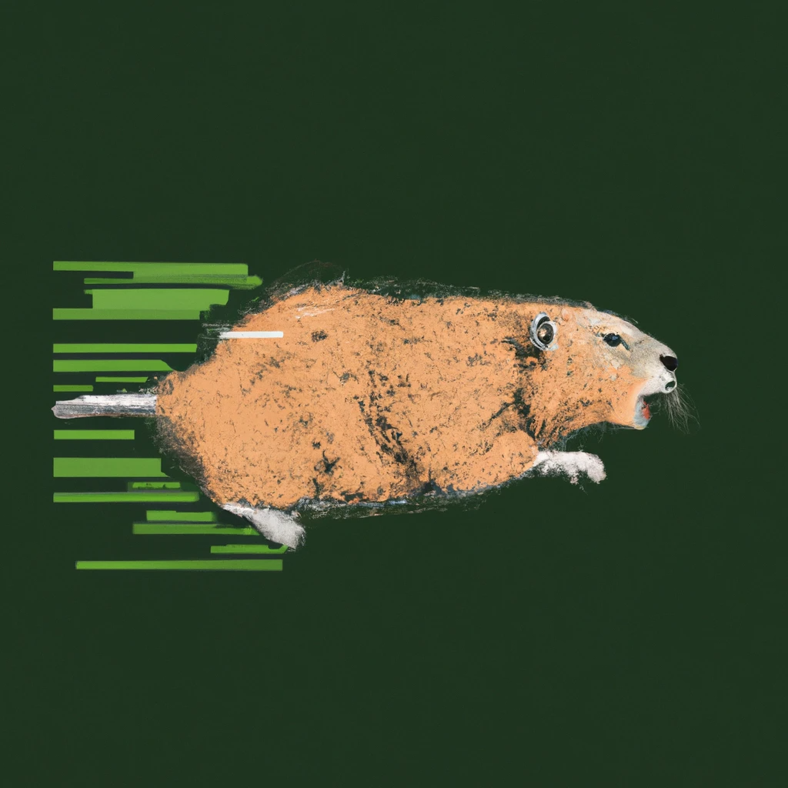

# CUC - Command-line URL Checker (and notifier)

| Citation |
| --------:|
| In Go we trust, its power we wield, |
| A language simple, yet revealed, |
| With concurrency at its core, |
| It's efficiency we adore. |
| |
| "Clear is better than clever," |
| Golang's mantra we deliver, |
| For code that's easy to read, |
| Is the key to success, indeed. |
| Like [Go Proverbs - Simple, Poetic, Pithy](https://go-proverbs.github.io/) |

CUC (English pronunciation: [_cuc_] / λευκός) is a very simple CLI tool to check various HTTP status for example if a webpage is available (200) or not found (404).

> Campinas (Portuguese pronunciation: [kɐ̃ˈpinɐs], Plains or Meadows) is a Brazilian municipality in São Paulo State, part of the country's Southeast Region. According to the 2020 estimate, the city's metropolitan area, contains twenty municipalities with a total population of 3,656,363 people, making it the fourteenth most populous Brazilian city and the third most populous municipality in São Paulo state. (Source: Wikipedia)

---

. **[Overview](#overview)** .
**[Features](#features)** .
**[Supported backends](#supported-backends)** .
**[Quickstart](#quickstart)** .
**[Web UI](#web-ui)** .
**[Documentation](#documentation)** .

. **[Support](#support)** .
**[Release cycle](#release-cycle)** .
**[Contributing](#contributing)** .
**[Maintainers](#maintainers)** .
**[Credits](#credits)** .

---

## Overview

## Quickstart

## Credits

"A gopher playing with streams of data, logo, digital art, drawing" generated by <a href="https://labs.openai.com/" target="_blank">DALL·E (OpenAI)</a>